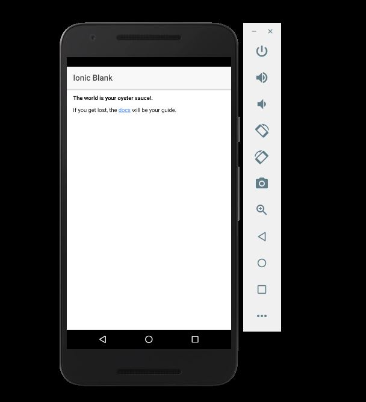

[Markdown cheatsheet](https://github.com/adam-p/markdown-here/wiki/Markdown-Cheatsheet)

# 100 Days Of Code - Log

### :white_check_mark: Day 6| portfolio update and publish using Netlify

Portfolio update - there is no hover on mobile devices by default so I had to fix issues with my overlay buttons getting clicked right away rather than showing the overlay first. Also got started with 
@Netlify
 to host my site https://leandroseverino.netlify.com 😀

 **Thoughts**: Maybe I should start looking for clients that needs static websites. Checkout netlify cms.

### :white_check_mark: Day 5 | worked on my portfolio website again

**Today's Progress**: 
- Enhanced a lot my portfolio website. add gradient image, update skills section from circle to rects. Update colors.

**Thoughts**: It's all going to be worth it. I'm going to get that JOB!

### :white_check_mark: Day4 | worked on my portfolio website

**Today's Progress**: 
- I just worked on my portfolio website.

### :white_check_mark: Day 3 | Get Started with Typescript & upgrade understanding of MVC architecture

**Today's Progress**: 
- I learned about Typescript today and now I understand what makes it a great. New stuff I learned: Type Assertions, Interfacesm, Access modifiers, Access modifiers in Constructor Parameters, Properties. 

**Thoughts**: I'm happy I learned a lot today but I didn't work on any project for today. But still I think I gained a lot important learning today.

### :white_check_mark: Day 2 | portfolio site update and learn animation performance

**Today's Progress**: 
- I leared stuff about animation perfomance and updated my portfolio. I was able to speak to a Wordpress expert too shared with me his interest on working with me. 

Portfolio site: https://leanseverino1022.github.io/IamPuyih-2.0/

**Thoughts**: I love my progress and I think I've worked hard for my goals. It's just been difficult to prioritize stuff lately. If I could just land that job or project that could give me a good pay. I'll get there.

## :white_check_mark: Day 1 | Test/Run Ionic app in Android Studio emulator 

The Goal for today was to test the app on an Android Studio emulator - accomplished! I also did multiple projects and did modify texts for testing.

:clock1: more than 3 hours

**Thoughts**: I ran into a lot of issues getting this to work. Maybe I will research about Docker and use it to prevent a lot of configuration headaches later on.

## :white_check_mark: Day 0 | Getting Started with Ionic 3. Run a basic app in the browser.

<!--  -->

The goal is just to get started.

:clock1: 1 hour

**Tips / Learnings**: Different people progress at different rates and learn in different ways.

**Thoughts**: Nice progress. May be small but just to get started is big.

<!-- **Link to work:** [Calculator App](http://www.example.com) -->

